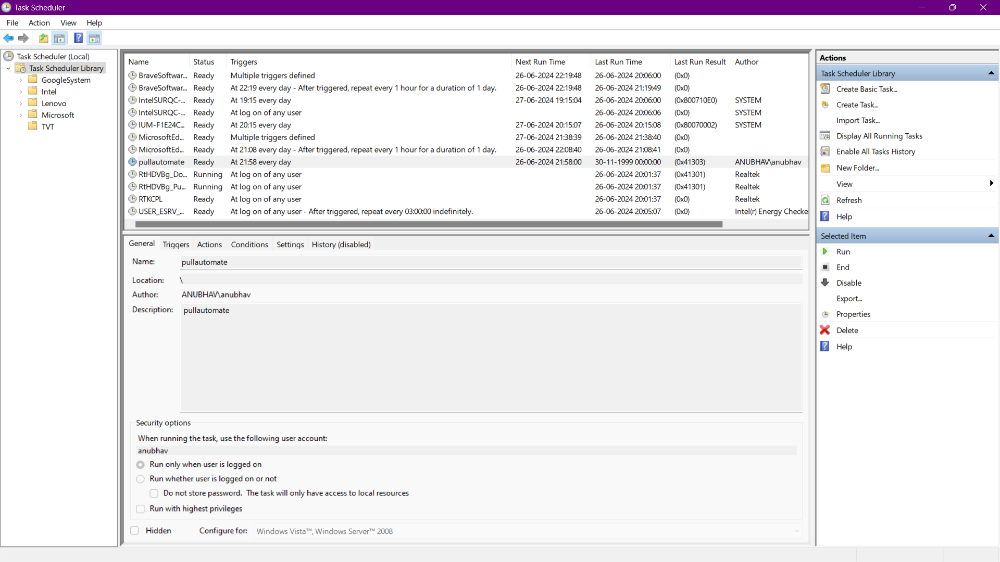
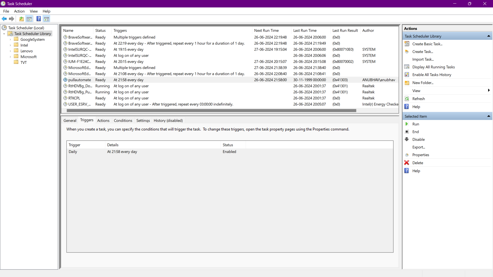
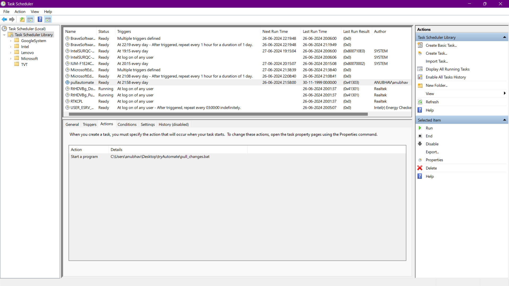
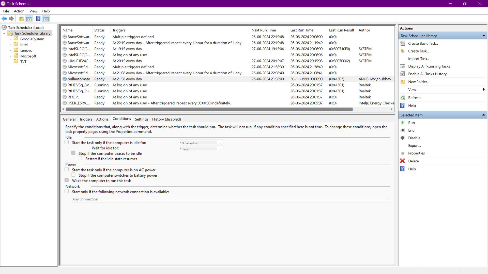
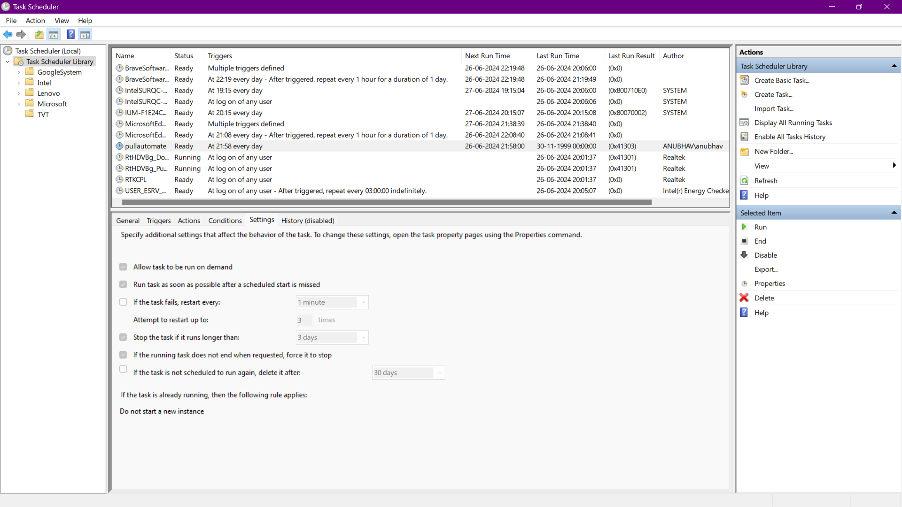

- ### Create a directory named `AutomatingPull` inside that :-

  - #### Create a file with name `pull_changes.bat`.
  - #### copy and paste the contents of `pull_changes.bat` to that file.
    - #### Now in `pull_changes.bat` here you have to replace the path to your `logfile.txt` and in 2nd line you have to provide the path to you `Github Repo` where you want the changes to be pulled.
  - #### create a logfile.txt

- ### Run the `pull_chnages.bat` file to check whether it is working correctly or not.

- ### After this .....

  - ### Method 1

  <pre>
  <b>This will only work 1 time when you Turn-On/Power-On the system, else you can use method 2(windows task scheduler)</b>
  - Press  <b>Windows + R</b> to open the Run dialog box.
  - Type <b>shell:startup</b> and press Enter to open the Startup folder.
  - Copy the <b>pull_changes.bat</b> file and paste it into the Startup folder.
  </pre>

  - ### Method 2
    <pre>
      * Press <b>Windows button</b> and search for <b>Task Scheduler</b>
        or  
      * You can open Run by <b>pressing Windows + R</b> and type <b>taskschd.msc</b> to open the Task Scheduler
      * Now click on create task and for settings refer to the <b>images</b> given below or you can use some settings based upon other available options:
    </pre>
    
    
    
    
    
